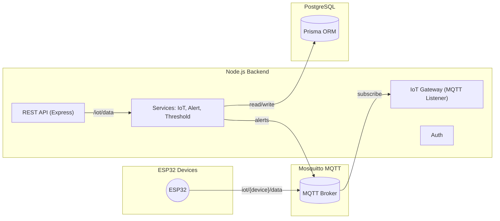

## IoT Logistics Backend (Node.js + Express + Prisma)

Production-ready backend for smart delivery with IoT devices (ESP32). Supports REST + MQTT ingestion, JWT auth, PostgreSQL storage, realtime WebSocket updates, and comprehensive analytics.

### ✨ Version 2.0 Features
- ✅ **Realtime WebSocket Server** - Socket.IO with JWT authentication
- ✅ **Analytics Dashboard** - Device stats, sensor aggregations, alert tracking
- ✅ **Shipment Management** - Complete CRUD with tracking data
- ✅ **Enhanced Security** - Rate limiting, CORS, Helmet middleware
- ✅ **Pagination Support** - All list endpoints support pagination
- ✅ **Comprehensive Testing** - 5 test scripts with 100+ test cases

### Stack
- Node.js 20, Express (ES Modules)
- Prisma ORM + PostgreSQL
- Socket.IO 4.x (WebSocket)
- MQTT (Mosquitto)
- JWT (jsonwebtoken)
- Winston + Pino HTTP logging
- Docker + Docker Compose

### Quick Start
1) Copy env and review values
```bash
cp .env.example .env
```

2) Install deps
```bash
npm install
```

3) Start with Docker Compose
```bash
docker-compose up --build
```
This will bring up Postgres, Mosquitto, run migrations, seed data, and start the backend at http://localhost:3000.

#### Local without Docker
```bash
npx prisma migrate dev --name init
npm run seed
npm run dev
```

### REST API
- **Authentication**
  - POST `/auth/login` - { username, password } => { token, user }
  
- **IoT Data Ingestion**
  - POST `/iot/data` - Ingest sensor data (no auth required for devices)
  
- **Device Management**
  - GET `/device` - List all devices
  - GET `/device/:id` - Get device details
  - POST `/device` - Register new device
  - PUT `/device/:id` - Update device
  - DELETE `/device/:id` - Delete device
  - GET `/device/:id/sensors` - Get sensor data (paginated) ✨NEW
  - GET `/device/:id/location` - Get location history (paginated) ✨NEW
  
- **Vehicle Tracking**
  - GET `/vehicles` - List all vehicles
  - GET `/vehicles/:id` - Get vehicle details
  - GET `/vehicles/:id/track` - GPS track (paginated, fixed)
  
- **Order Management**
  - GET `/orders` - List all orders
  - GET `/orders/:id` - Get order details
  - GET `/orders/:id/track` - Order tracking (paginated, fixed)
  
- **Shipment Management** ✨NEW
  - POST `/shipments` - Create shipment
  - GET `/shipments` - List shipments (paginated, filterable)
  - GET `/shipments/:id` - Get shipment with tracking data
  - PUT `/shipments/:id` - Update shipment
  - DELETE `/shipments/:id` - Delete shipment
  - GET `/shipments/stats` - Shipment statistics
  
- **Analytics & Statistics** ✨NEW
  - GET `/analytics/dashboard` - Dashboard overview (24h)
  - GET `/analytics/devices` - Device statistics
  - GET `/analytics/sensors/:deviceId` - Sensor min/max/avg
  - GET `/analytics/alerts` - Alert statistics
  - GET `/analytics/shipments` - Shipment statistics
  
- **Realtime** ✨NEW
  - WebSocket: `ws://localhost:3000` - Socket.IO connection
  - GET `/api/stream/devices/:id` - SSE fallback
  - GET `/api/realtime/stats` - Connection statistics

📚 **Full API Documentation:** [docs/API_REFERENCE.md](./docs/API_REFERENCE.md)

### MQTT Topics
- `iot/{device_id}/data` - device -> server (JSON)
- `iot/{device_id}/alert` - server -> device alerts
- `iot/{device_id}/config` - server -> device config (future)

### Payload Format
IoT data submission (HTTP or MQTT):
```json
{
  "timestamp": "2024-01-16T10:00:00Z",
  "temperature": 25.5,
  "humidity": 60.2,
  "vibration": 0.8,
  "gps": {
    "latitude": 10.762622,
    "longitude": 106.660172,
    "speed": 45.5
  }
}
```

### WebSocket Events ✨NEW
```javascript
// Connect with JWT authentication
const socket = io('http://localhost:3000', {
  auth: { token: 'your-jwt-token' }
});

// Subscribe to device updates
socket.emit('subscribe:device', { deviceId: 'ESP32-001' });

// Listen for realtime events
socket.on('sensor:reading', (data) => { /* temperature, humidity, vibration */ });
socket.on('device:location', (data) => { /* GPS coordinates */ });
socket.on('alert:new', (data) => { /* threshold alerts */ });
```

📚 **WebSocket Guide:** [docs/REALTIME_GUIDE.md](./docs/REALTIME_GUIDE.md)

### Architecture (Mermaid)


### IoT Data Flow
1. Device sends `{ device_id, data }` via MQTT topic `iot/{device_id}/data` or REST `/iot/data` with JWT.
2. Backend authenticates JWT (for REST) and looks up device by `device_id`.
3. Parse JSON data directly (no encryption/decryption).
4. Persist to `SensorData` with GPS/temperature/humidity.
5. Check `Threshold` per device; if out of range, create `Alert` and publish MQTT `iot/{device_id}/alert`.
6. Dashboard/mobile consumes REST endpoints for tracking.

### Notes
- Use HTTPS in production (behind reverse proxy).
- Rotate JWT secrets periodically.
- WebSocket connections throttled (sensors: 2Hz, GPS: 1Hz).
- Rate limiting: 100 req/15min (general), 60 req/min (IoT).

---

## 🧪 Testing

### Quick Test Commands
```bash
# Run all API tests
npm run test:api

# Interactive API testing
npm run test:api:interactive

# Test IoT device simulation
npm run test:iot

# Test shipment workflow
npm run test:shipment

# Test WebSocket connection
npm run test:socket

# Quick performance test
npm run test:performance

# Full test suite
npm run test:all
```

### Test Scripts
- **test-api.js** - Complete API testing (100+ test cases)
- **test-iot-device.js** - IoT device simulator (MQTT/HTTP)
- **test-shipment-workflow.js** - End-to-end shipment lifecycle
- **test-socket-client.js** - WebSocket connection testing
- **test-performance.js** - Load testing & performance metrics

📚 **Testing Guide:** [scripts/QUICK_GUIDE.md](./scripts/QUICK_GUIDE.md)

---

## 📚 Documentation

- **[API Reference](./docs/API_REFERENCE.md)** - Complete API documentation with examples
- **[Realtime Guide](./docs/REALTIME_GUIDE.md)** - WebSocket integration guide
- **[Implementation Summary](./docs/IMPLEMENTATION_SUMMARY.md)** - System overview & improvements
- **[Deployment Checklist](./docs/DEPLOYMENT_CHECKLIST.md)** - Production deployment guide
- **[Testing Scripts](./scripts/README.md)** - Comprehensive testing documentation

---

## Kiến trúc dự án (Architecture)

### Thành phần chính
- Backend (Express, ESM): xử lý REST, MQTT, xác thực, lưu DB, phát cảnh báo.
- PostgreSQL + Prisma: lưu trữ users, devices, shipments, orders, sensorData, thresholds, alerts.
- Mosquitto (MQTT): nhận dữ liệu từ thiết bị; backend subscribe `iot/+/data` và publish alert/config.
- Logger: Pino cho HTTP và Winston cho ứng dụng.

### Cấu trúc thư mục
```
src/
  app.js                # cấu hình Express, routes, middlewares
  server.js             # khởi động HTTP + MQTT + DB
  config/
    database.js         # Prisma client + connectDb
    mqtt.js             # khởi tạo MQTT client và subscribe topics
    jwt.js              # thông số JWT
    dotenv.js           # nạp biến môi trường
  controllers/          # xử lý HTTP cho từng module
    authController.js
    iotController.js
    orderController.js
    vehicleController.js
    configController.js
  services/             # nghiệp vụ lõi
    iotService.js       # parse/persist sensor data
    alertService.js     # kiểm tra ngưỡng và phát cảnh báo
    thresholdService.js # CRUD ngưỡng theo thiết bị
  routes/               # khai báo endpoints
    authRoutes.js
    iotRoutes.js
    orderRoutes.js
    vehicleRoutes.js
    configRoutes.js
  middleware/
    auth.js             # JWT auth middleware
    errorHandler.js     # 404 + global error handler
  utils/
    logger.js           # Winston + Pino logger
    response.js         # helpers phản hồi chuẩn JSON
prisma/
  schema.prisma         # mô hình dữ liệu
  seed.js               # dữ liệu mẫu
mosquitto/
  mosquitto.conf        # cho phép kết nối từ container khác
```

### Mô hình dữ liệu (tóm tắt)
- `User`: tài khoản quản trị/ứng dụng.
- `Device`: thiết bị IoT (deviceId và secretHash để lấy JWT).
- `Vehicle`: phương tiện vận chuyển.
- `Order`: đơn hàng.
- `Shipment`: gắn `Order` + `Device` + `Vehicle` theo chuyến.
- `SensorData`: nhiệt độ, độ ẩm, GPS theo thời gian.
- `Threshold`: ngưỡng theo thiết bị cho nhiệt độ/độ ẩm.
- `Alert`: lưu cảnh báo khi vượt ngưỡng.

## Bảo mật & xác thực
- JWT áp dụng cho user và device.
- Device lấy JWT qua `/auth/device` bằng `deviceId` + `secret` (hash lưu trong DB).
- Payload từ device gửi lên dưới dạng JSON thuần túy (không mã hóa).

## Dòng dữ liệu IoT chi tiết
1. Thiết bị gửi MQTT `iot/{device_id}/data` hoặc REST `/iot/data` (header Bearer token với JWT device).
2. Backend tìm `Device` theo `device_id`.
3. Parse JSON data trực tiếp → `{ temperature, humidity, gps, orderId, vehicleId }`.
4. Lưu `SensorData` (bao gồm GPS nếu có).
5. Đọc `Threshold` theo thiết bị, so sánh giá trị; nếu vượt ngưỡng → tạo `Alert` và publish MQTT `iot/{device_id}/alert`.

## Tài liệu MQTT

### Publish từ thiết bị → server
- Topic: `iot/{device_id}/data`
- Payload (JSON):
```json
{
  "device_id": "esp32-001",
  "data": {
    "temperature": 5.1,
    "humidity": 56.3,
    "gps": { "lat": 10.78, "lon": 106.66 },
    "orderId": 1,
    "vehicleId": 1
  }
}
```

### Publish từ server → thiết bị
- Topic: `iot/{device_id}/alert`
- Payload (JSON):
```json
{
  "alerts": [
    { "type": "temperature", "value": 9.5, "thresholdId": 1 }
  ],
  "at": "2025-01-01T00:00:00.000Z"
}
```

## Hướng dẫn sử dụng REST API

### 1) Auth

#### Đăng nhập user
- Method: POST
- URL: `/auth/login`
- Body:
```json
{ "email": "admin@example.com", "password": "admin123" }
```
- 200 OK:
```json
{ "token": "<jwt>" }
```
- Curl:
```bash
curl -sS -X POST http://localhost:3000/auth/login \
  -H "Content-Type: application/json" \
  -d '{"email":"admin@example.com","password":"admin123"}'
```

#### Xác thực thiết bị
- Method: POST
- URL: `/auth/device`
- Body:
```json
{ "deviceId": "esp32-001", "secret": "devicesecret" }
```
- 200 OK:
```json
{ "token": "<jwt>" }
```

### 2) Ingest dữ liệu IoT (REST)
- Method: POST
- URL: `/iot/data`
- Headers: `Authorization: Bearer <device_jwt>`
- Body:
```json
{
  "device_id": "esp32-001",
  "data": {
    "temperature": 5.2,
    "humidity": 60.1,
    "gps": {
      "lat": 10.78,
      "lon": 106.66
    },
    "orderId": 1,
    "vehicleId": 1
  }
}
```
- 201 Created:
```json
{ "success": true, "data": { "id": 1, "deviceId": 1, "createdAt": "...", "temperature": 5.2, "humidity": 60.1, "latitude": 10.78, "longitude": 106.66, "orderId": 1, "vehicleId": 1 } }
```

### 3) Tracking đơn hàng
- Method: GET
- URL: `/orders/:id/tracking`
- Headers: `Authorization: Bearer <user_jwt>`
- 200 OK:
```json
{ "success": true, "data": [ { "id": 10, "temperature": 5.1, "humidity": 56.2, "latitude": 10.78, "longitude": 106.66, "createdAt": "..." } ] }
```

### 4) Vị trí xe
- Method: GET
- URL: `/vehicles/:id/track`
- Headers: `Authorization: Bearer <user_jwt>`
- 200 OK:
```json
{ "success": true, "data": [ { "latitude": 10.78, "longitude": 106.66, "createdAt": "..." } ] }
```

### 5) Cấu hình ngưỡng theo thiết bị

#### Lấy ngưỡng
- Method: GET
- URL: `/config/device/:id` (id là `deviceId`, ví dụ `esp32-001`)
- Headers: `Authorization: Bearer <user_jwt>`
- 200 OK:
```json
{ "success": true, "data": { "deviceId": "esp32-001", "thresholds": [ { "type": "temperature", "min": 2, "max": 8 } ] } }
```

#### Cập nhật/Upsert ngưỡng
- Method: POST
- URL: `/config/device/:id/update`
- Headers: `Authorization: Bearer <user_jwt>`
- Body:
```json
{ "type": "temperature", "min": 2, "max": 8 }
```
- 200 OK: trả về bản ghi `Threshold` sau upsert.

## Mã lỗi & xử lý lỗi
- 400: dữ liệu đầu vào không hợp lệ (Joi validation).
- 401: thiếu/không hợp lệ JWT.
- 404: không tìm thấy tài nguyên.
- 500: lỗi hệ thống; xem logs để biết chi tiết.

## Khuyến nghị triển khai
- Đặt backend sau reverse proxy (Nginx/Traefik) và bật HTTPS.
- Bật auth trên Mosquitto trong môi trường sản xuất; tắt `allow_anonymous` và dùng user/pass/TLS.
- Tạo chỉ mục DB theo `orderId`, `vehicleId`, `deviceId`, `createdAt` để tối ưu truy vấn tracking.

